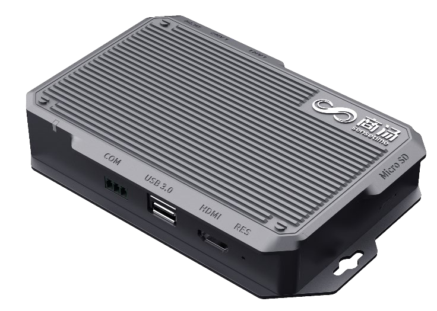

title: 浅谈Nebula-M 测试实践
speaker: yangxinming
transition: slide
files: /css/base.css
plugins:
    - echarts
    - mermaid
    - katex

<slide class="bg-black-blue aligncenter" image="https://source.unsplash.com/C1HhAQrbykQ/ .bg-primary">

# 浅谈Nebula-M 测试实践 {.text-landing.text-shadow}
---
By YangXinMing {.text-intro}

<slide class="size-100" image="https://source.unsplash.com/n9WPPWiPPJw/">

<slide class="size-100">
:::card

## Nebula-m 是什么？
 * 边缘算力{.animated.zoomIn}
 * 继电器开灯{.animated.zoomIn.delay-400}
 * videowall{.animated.zoomIn.delay-800}

---

:::

<slide class="">
:::column
#### 视频接入
 * 支持网络摄像机 ONVIF、RTSP、GB28181 标准协议
 * 支持视频编码格式 H.264
 * 支持最大视频分辨率 1080P
 * 支持人脸检测感兴趣区域设置
 * 支持最小、最大人脸像素设置

#### 图片接入
 * 支持 SenseDLC AA 系列、11 系列、D 系列、T 系列抓拍机接入
 * 支持其他主流厂家抓拍机等抓拍设备 SDK 二次开发接入

--- 
#### 人脸功能
 * 人脸检测、跟踪、抓拍，抓拍及告警记录查看、条件检索、导出
 * 支持人脸 1:1、1:N 比对，返回相似度等信息
 * 人脸小图、场景大图、人脸质量分数、人脸属性推送
 * 人脸属性包括年龄、性别、胡子、口罩、眼镜、帽子等

#### 人体功能
 * 人体检测、跟踪、抓拍，抓拍记录查看、条件检索、记录导出
 * 人体属性包括朝向、年龄、性别、帽子、头发、上衣、下衣、鞋子、口罩、雨伞、箱包等

#### 人像库
 * 支持黑/白名单库新增、编辑、删除，人像库图片导入、导出、编辑、删除

#### 信号联动
 * 网络继电器信号联动控制
:::

<slide class="">
## Nebula-m 的工作方式

<slide class="">
# 从三个小实践开始{.text-landing}

---
 * 智能开关{.animated.zoomIn}
 * 继电器开灯{.animated.zoomIn.delay-400}
 * videowall{.animated.zoomIn.delay-800}

<slide :class="size-80">
:::card

## 第一部分
.card-50.bg-white

 [Unsplash](http://Unsplash.com) is a really cool resource. It is a collection of Creative Commons Zero licensed photos that are really great. {.text-intro}

 * :Role\::{.text-label} Frontend
 * :client\::{.text-label} Acme
 * :year\::{.text-label} 2018
 {.description}

---

:::
<slide class="">
# 智能开关
<slide class="">
# 继电器开灯
<slide class="">
# videowall
<slide class="bg-black-blue aligncenter" video="https://webslides.tv/static/videos/working.mp4 poster='https://webslides.tv/static/images/working.jpg' .dark">
