### 浅谈SenseNebula-M 测试实践 
By Yang XinMing

---
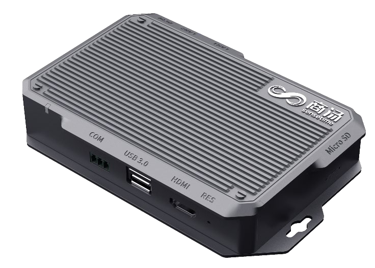

---
## Agenda 
 * 关于SenseNebula-M 
 * 我们是如何完成测试的？
 * 之前的设想，以及未来的计划
 * Q&A 

---

    <i class="fa fa-bookmark fa-stack-2x"></i>
    <strong class="fa-stack-1x" style="color: white;">1</strong>

### SenseNebula-M 是什么？

---
### TL;DR = 提供算力,人脸,人体等分析功能 
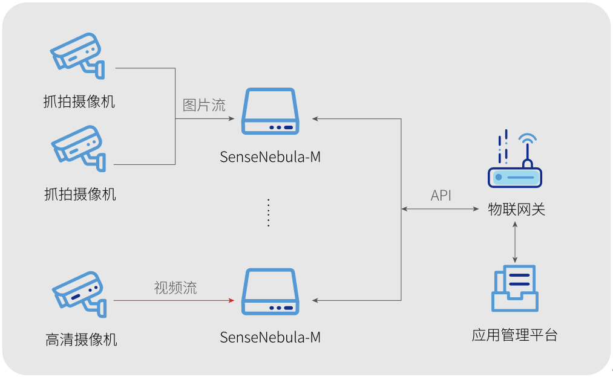

---
### 产品主要功能  
* 视频接入 
* 图片接入
* 人像库
* 人脸功能
* 人体功能
* 信号联动

---
#### Releases
*From 2019.05.30 To 2020.03.26 ,More Than 16 Releases* 
 * 硬件 
   * 一代TX2平台, 二代3559A平台 
   * 研扬，宝德，天地 
 * 软件  
   * 标准版 v1.0.0 v1.2.0 v1.3.0 v2.0.0 v2.0.x 
   * MQTT版 v1.0.0 v1.2.0 v2.0.0 
   * 国际版，社区版，测温版，蓝光版 \.etc 

---
#### 测温版
<video height="500" controls autoplay loop muted onclick="myfunction(this)">
    <source src="public/img/cctv.mp4" type="video/mp4">
</video>

---
## DEMO 

---

    <i class="fa fa-bookmark fa-stack-2x"></i>
    <strong class="fa-stack-1x" style="color: white;">2</strong>

#### 嵌入式设备测试的难点 
 * 需特别注重产品稳定性,健壮性,易用性 
 * 需适配场景众多,另需兼容各类设备 
 * 硬件本身资源有限,功能修改容易引入性能问题 
 * 版本较多,回归压力大 

---
#### 我们的测试设备 
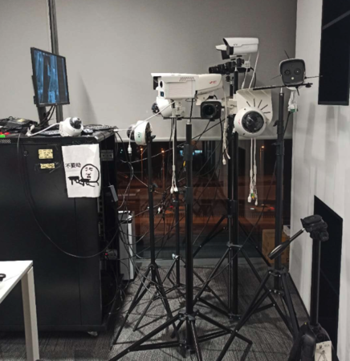

---
### 从四个小的实践开始

---
### 智能插座
 *  **BEFORE**   手动盒子测试断电，每次最多测几十次 
 *  **AFTER**   通过自动化之后，可以反复断电1晚 
 * [插座文档](/plug.pdf) 

---
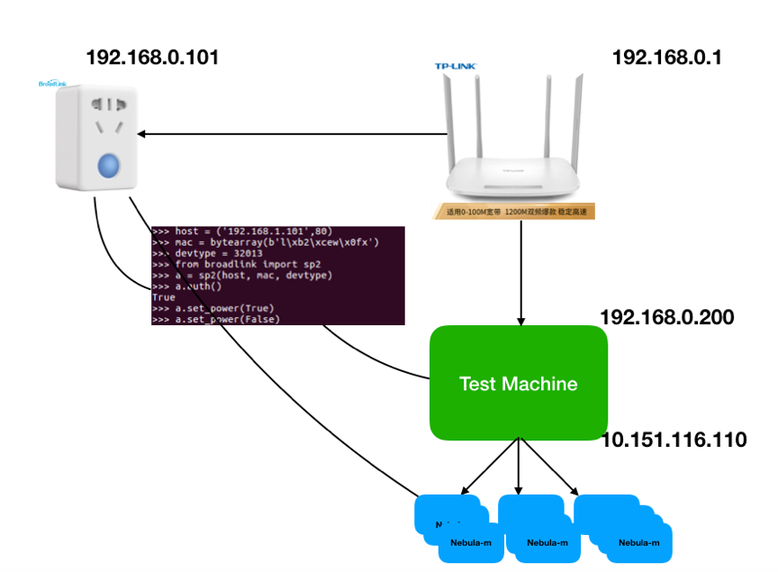

---
<video height="600" width="340" controls autoplay loop muted onclick="myfunction(this)">
    <source src="public/img/plug.mp4" type="video/mp4">
</video>

---
### 网络继电器开🚪   
 *  **BEFORE**   只能通过听继电器的滴答声来确定触发 
 *  **AFTER**   现在观察灯的闪烁就可以了解触发情况 

---
<video height="600" width="340" controls autoplay loop muted onclick="myfunction(this)">
    <source src="public/img/light.mp4" type="video/mp4">
</video>

---
### 视频制作
<video width="700" controls autoplay loop muted onclick="myfunction(this)">
    <source src="public/img/tmp720p.mp4" type="video/mp4">
</video>

---
### videowall
<video width="700" controls autoplay loop muted onclick="myfunction(this)">
    <source src="public/img/videowall.mov" type="video/mp4">
</video>

---
### 我们测试的目标 
* 有限时间
* 有限人力
* 保证覆盖
#### 保证产品质量，做到心里有数 

---
### 我们测试的覆盖（E2E） 
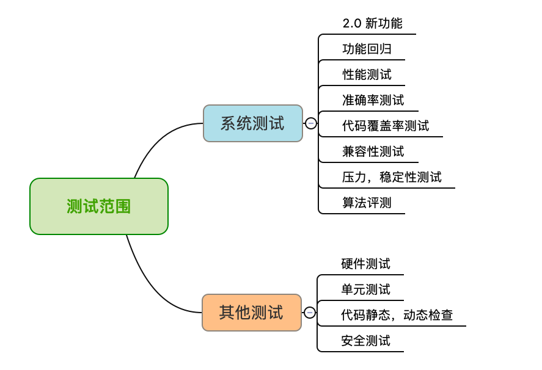

---
### 我们的做法 Philosophy 
Test Automation as a Key Enabler for High-performing Teams 

---
#### 主要依靠自动化
 * 覆盖
   * 通过API覆盖超过 **80%**  以上的测试 
   * 功能，兼容性，准确率，稳定性，覆盖率 .etc
 * 优点
   * 有效的测试的覆盖, 回归
   * 测试的稳定性
   * 完成一些手动不可能完成的事情
 * 缺点
   * 需要开发的时间
 * 自动化开发需要做到
   * 稳定性
   * 可维护性
   * 易用性
   * 可扩展性

---
#### 结合部分手动
  * 延时
  * 网络
  * Web(做了部分的自动化)
  * 对接

<video width=300 controls autoplay loop muted class="tobuild" onclick="myfunction(this)">
    <source src="public/img/delay.mov" type="video/mp4">
</video>

---
#### 另外
  * 主动的推动流程的规范化，需求，开发自测，打包，提测，release流程
  * 在项目相对空挡，或者pending的时候，提前做一下技术上的准备，比如完成框架的优化。

---
### 我们是如何执行自动化 
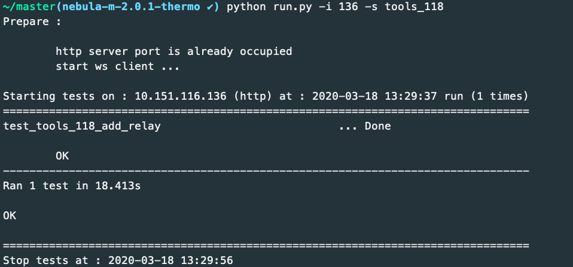

---
### 我们是如何执行自动化 
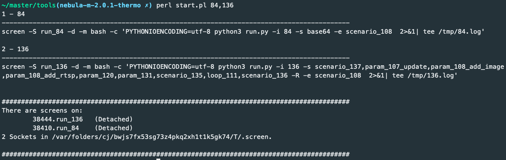

---
### 我们是如何执行自动化 
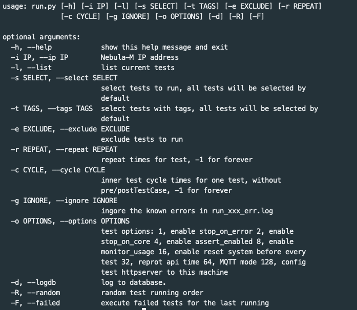

---
#### Why those options?
 * ip  指向测试的盒子 
 * list  哪些case可以执行? 
 * select,exclude  选择需要的用例
 * tag  选择相关的测试用例 
 * repeat,cycle  多次运行 
 * random  随机执行顺序
 * failed  执行上一次出错的用例
 * ignore  去除重复的err message 到err.log里
 * common options  一些框架执行的配置

---
### 自动化运行的输出 
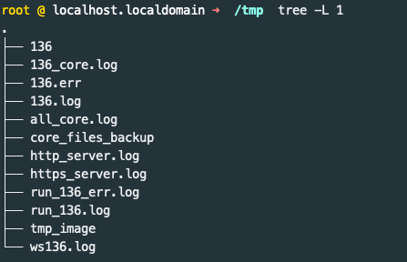

----
##### running logs 
  * summary  stdout xxx.log 
  * details  run_xxx.log run_xxx_err.log 
  * core  core files  core_files_backup, trace  xxx_core.log 
  * faied case  xxx.err

##### mock receiving 
  * http/https   posted info 
  * ws  web socket emit
  * tmp_image  received images

----
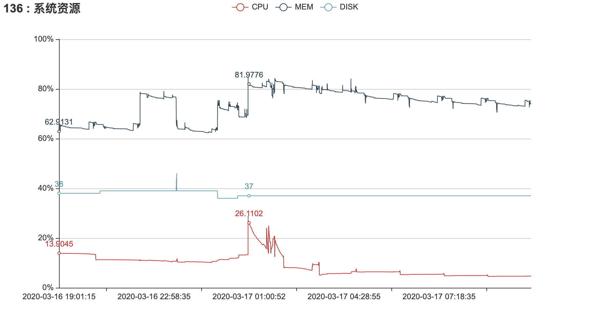

---
#### 我们是如何自动化开发的
* 效率为先
   * 共识：风格一致(Convention Over Configuration)
   * 解耦：框架,用例(DRY, test script reflects test design)
   * 反馈：多提交，多执行(Agile, feedback timely)
* 最终实现
   * built on requests, unittest, paramiko .etc
   * file based tests
   * lightweight, easy to manage, setup and maintain, adaptable, scalable, flexable
   * support all kinds of tests, api, web, tools, performance, accuracy .etc

---
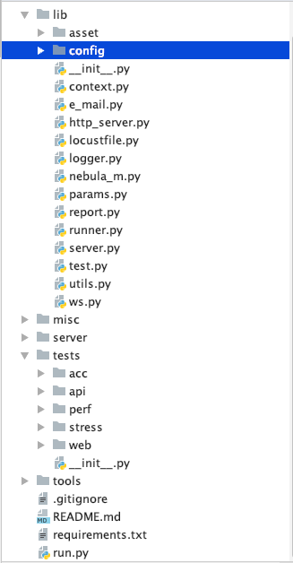

---
### 如何写一个用例 
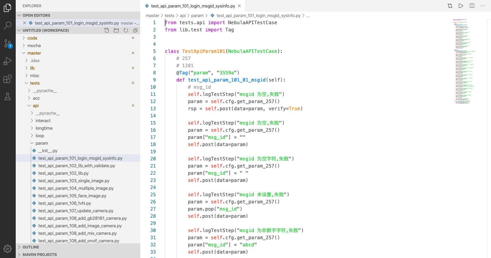

---
#### 测试报告
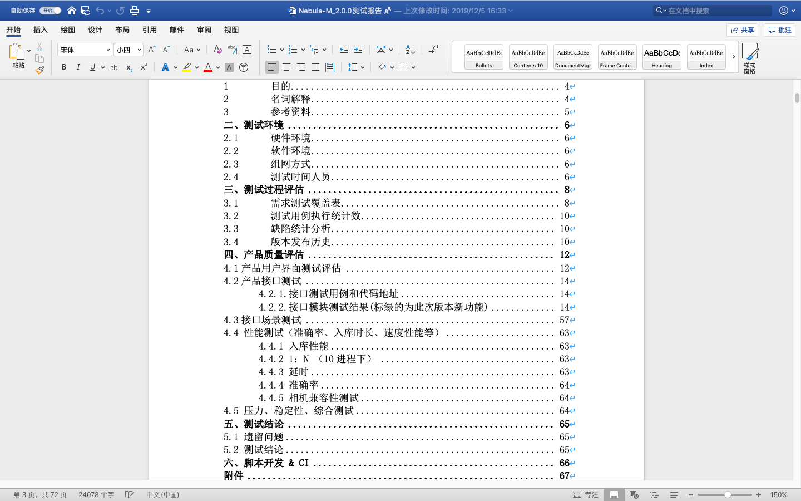

---
#### 准确率测试
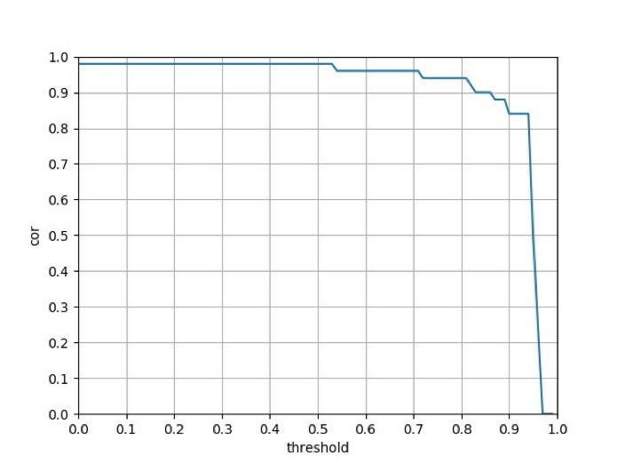

---
#### 代码覆盖率 [结果](http://10.151.3.74:3500/gcov/CoverageTest4/resultInfo.html)

---
#### 延时测试
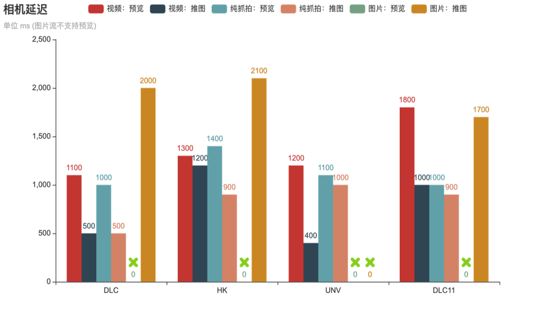

---

    <i class="fa fa-bookmark fa-stack-2x"></i>
    <strong class="fa-stack-1x" style="color: white;">3</strong>

### 我们之前的计划 
 
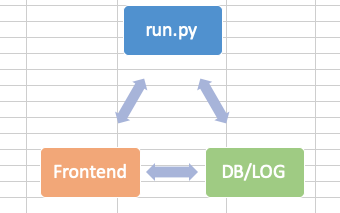

---

<video width=900 controls autoplay loop muted onclick="myfunction(this)">
    <source src="public/img/nebula-m_testserver.mov" type="video/mp4">
</video>

---
### 未来计划 
 * Viper-Lite 平台测试 SEP 
 * SenseNebula-M Lite迁移 ：
   * 旧API功能上不变，考虑使用现有框架
   * 新API,新功能使用SEP
 * 现有测试框架SEP 集成 

---
#### Practices(aka Ideas) 
 * 精准测试(差异化测试）
 * On-demand Test Infrastructure 
 * Preposition testing (Compile Time Errors, Runtime Errors, Logic Errors)  
 * Connections (GitLab, Test Harness, Jira) .etc 

---

    <i class="fa fa-bookmark fa-stack-2x"></i>
    <strong class="fa-stack-1x" style="color: white;">4</strong>

# Thanks!  
### Any questions?  

